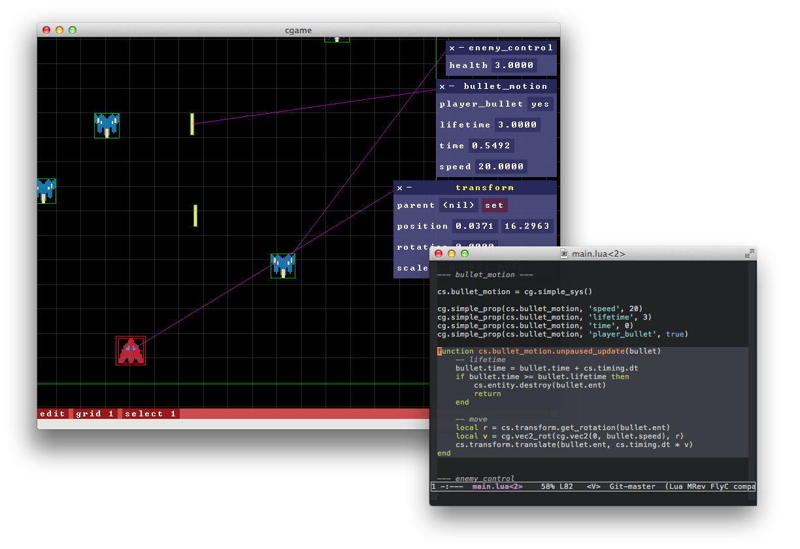

* [paper](http://www.nikhilesh.info/files/cgame.pdf) (May 2014)
* [poster](http://www.nikhilesh.info/files/cgame-poster.pdf) (May 2014)

NOTE: the 'cgame' executable looks for data in './data' so make sure you run it
with the repository root as working directory

test/platformer/main.lua has code for a simple platform game. Shows
how to make systems in Lua.

test/keyboard_controlled.{c,h} shows a simple system implemented in C.
It allows control of the transform of an object through the arrow
keys, M/N keys to rotate and I/K keys to scale. This works even when
attached to the camera, in which case I/K can be used to zoom in and
out (this is an effect of how transform scaling affects the camera).

Building
---

CMake should make it easy to set up. [GLFW](http://www.glfw.org/),
[GLEW](http://glew.sourceforge.net/),
[stb_image](http://code.google.com/p/stblib/),
[LuaJIT](http://luajit.org/),
[chipmunk](http://chipmunk-physics.net/), [Gorilla
Audio](https://code.google.com/p/gorilla-audio/) are dependencies and
are included in ext/. From the repository root,

    cmake -E make_directory build
    cmake -E chdir build cmake ..
    cmake --build build

The above instructions have been tested under OSX with clang+make, and
less recently on Linux with gcc+make and Windows with Visual Studio 2013.

Running
---

After building just run the 'cgame' executable. This is put in the
build directory by clang+make, and under build/Debug or build/Release
by Visual Studio 2013. Make sure your working directory is the root of
the project (cgame looks for core data in './data'). It takes a
startup script as the first argument. So after running the commands in
the previous section, you could do,

    ./build/cgame test/platformer/main.lua

There are some other tests in test/. Try test/physics.lua! You could
also just fire up cgame with no startup script and write stuff in
usr/scratch.lua to code live! It'll run the contents of that file
whenever it is modified.
